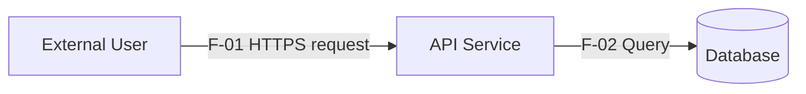

# Threat Modeling Skill

## Purpose

Use this skill to create or update a practical, reviewable threat model for a
software system, service, API, architecture, repository, feature, or design
change.

The skill is intentionally vendor-neutral. It does not assume a specific cloud,
LLM provider, security platform, issue tracker, threat-modeling product, or
development environment.

The goal is not to produce the largest possible list of threats. The goal is to
produce a traceable security model that helps engineers and reviewers answer:

1. What are we working on?
2. What can go wrong?
3. What will we do about it?
4. Did we do a good enough job?

---

# Core principles

1. **Model before enumerating threats.**
   Do not start with a generic vulnerability list. Understand the system,
   assets, actors, data flows, trust boundaries, deployment assumptions, and
   attacker-controlled inputs first.

2. **Separate facts from assumptions.**
   Every important statement should be clearly classified as:
   - observed fact,
   - documented claim,
   - inferred assumption,
   - unknown requiring confirmation.

3. **Threats must be traceable.**
   Each threat should identify the affected component, flow, asset, or trust
   boundary and should have a stable ID.

4. **Enumeration and prioritization are separate steps.**
   Do not omit a plausible threat just because it initially appears low risk.

5. **Mitigations must be testable.**
   Prefer security requirements and verification criteria over vague advice.

6. **Use the simplest method that fits the problem.**
   STRIDE is the default systematic method. Add other techniques only when they
   provide additional value.

7. **Do not invent evidence.**
   Never claim a control exists unless there is evidence for it.

8. **Prefer explicit uncertainty over false precision.**
   Do not fabricate CVSS values, likelihood estimates, attack mappings, or
   standards references.

9. **Threat modeling is iterative.**
   A change to architecture, trust, data handling, privileges, interfaces, or
   dependencies may require the model to be updated.

---

# Operating modes

Choose the mode that best matches the available input.

## 1. Architecture mode

Use when provided with:

- architecture diagrams,
- design documents,
- API specifications,
- deployment descriptions,
- sequence diagrams,
- infrastructure descriptions.

Primary goal:
build a trustworthy system model and enumerate threats against it.

## 2. Repository mode

Use when analyzing source code.

Inspect enough of the repository to understand:

- entry points,
- exposed interfaces,
- authentication and authorization,
- privileged code paths,
- persistence,
- external dependencies,
- secrets handling,
- configuration,
- deployment assumptions,
- parser/deserializer boundaries,
- network clients and servers,
- background jobs,
- administrative interfaces.

Do not confuse code findings with the threat model itself. Code evidence should
support or contradict security assumptions.

## 3. Change-review mode

Use for a feature, pull request, architecture delta, or release.

Determine:

- what changed,
- what new assets or actors were introduced,
- what trust boundaries changed,
- what permissions changed,
- what data flows changed,
- what assumptions became invalid,
- what new threats appeared,
- what existing threats changed severity or mitigation status.

Prefer a delta report rather than regenerating the entire model unless the
change invalidates the system model.

## 4. Workshop mode

Use when the input is incomplete and the goal is collaborative analysis.

Create a provisional model and clearly list:

- known facts,
- assumptions,
- unknowns,
- questions that materially affect risk.

Do not block progress on unanswered questions when a useful provisional model
can still be produced.

---

# Threat-modeling workflow

## Phase 1 — Establish scope

Define:

- system or feature being analyzed,
- security-relevant goals,
- in-scope components,
- out-of-scope components,
- deployment context,
- relevant environments,
- relevant user populations,
- operational assumptions.

Record exclusions explicitly.

### Minimum scope questions

Determine, where applicable:

- What is the system intended to do?
- What must it protect?
- Who uses it?
- Who administers it?
- What external systems does it trust?
- What data enters and leaves?
- What privileges exist?
- What happens if confidentiality, integrity, or availability is lost?

---

## Phase 2 — Identify assets and security properties

List important assets such as:

- credentials,
- authentication tokens,
- cryptographic keys,
- personal data,
- financial data,
- proprietary data,
- configuration,
- audit records,
- source code,
- model weights,
- prompts,
- customer content,
- administrative functions,
- availability of critical services,
- integrity of security decisions.

For each significant asset, identify required properties:

- confidentiality,
- integrity,
- availability,
- authenticity,
- authorization,
- accountability,
- non-repudiation where relevant,
- privacy properties where relevant,
- safety properties where relevant.

---

## Phase 3 — Identify actors

Classify actors such as:

- anonymous user,
- authenticated user,
- privileged user,
- administrator,
- developer/operator,
- external service,
- compromised dependency,
- malicious insider,
- remote attacker,
- tenant,
- integration partner,
- automated agent.

Avoid assuming that every authenticated actor is trustworthy.

---

## Phase 4 — Build the system model

Create a concise model containing:

### Components

Assign stable IDs:

- `E-*` external entities,
- `P-*` processes/services,
- `D-*` data stores,
- `F-*` data flows,
- `TB-*` trust boundaries.

Example:

- `E-01` Browser client
- `P-01` API service
- `D-01` Primary database
- `F-01` Browser -> API request
- `TB-01` Internet -> application boundary

### For each component record

- purpose,
- trust level,
- privileges,
- authentication requirements,
- exposed interfaces,
- relevant assets,
- security assumptions.

### For each data flow record

- source,
- destination,
- protocol or transport,
- data classification,
- authentication,
- integrity protection,
- confidentiality protection,
- attacker influence.

### Trust boundaries

A trust boundary exists whenever data or control moves between components with
different:

- identity assumptions,
- privilege levels,
- ownership,
- administrative control,
- network trust,
- execution trust,
- tenant trust,
- confidentiality guarantees.

Pay special attention to trust-boundary crossings.

---

## Phase 5 — Identify attack surface

Enumerate externally or internally reachable attack surfaces:

- network listeners,
- API endpoints,
- web routes,
- file uploads,
- message queues,
- webhooks,
- parsers,
- deserializers,
- plugins/extensions,
- CLI interfaces,
- administrative consoles,
- identity-provider integrations,
- database interfaces,
- cloud metadata interfaces,
- secrets stores,
- CI/CD interfaces,
- dependency update paths,
- user-generated content,
- imported documents,
- agent/tool interfaces,
- inter-service calls.

Mark whether inputs are attacker-controlled, partially trusted, or trusted.

---

## Phase 6 — Enumerate threats

### Default method: STRIDE per element

Apply STRIDE systematically to each relevant component, flow, and trust
boundary.

#### Spoofing

Ask:

- Can an attacker impersonate a user, service, device, or workload?
- Are credentials transferable, replayable, forgeable, or weakly bound?
- Can identity claims cross a trust boundary without sufficient validation?

#### Tampering

Ask:

- Can data, configuration, messages, code, or state be modified?
- Are integrity checks missing?
- Can an attacker alter requests after authorization decisions?

#### Repudiation

Ask:

- Can important actions occur without reliable attribution?
- Are logs incomplete, mutable, ambiguous, or unauthenticated?
- Can multiple actors share identities or credentials?

#### Information disclosure

Ask:

- Can sensitive information leak through responses, logs, caches, telemetry,
  errors, metadata, backups, side channels, or authorization failures?
- Can tenants access each other's data?

#### Denial of service

Ask:

- Can attackers exhaust CPU, memory, storage, connections, quotas, queues,
  downstream services, or expensive operations?
- Are amplification paths present?

#### Elevation of privilege

Ask:

- Can an actor gain capabilities beyond those intended?
- Can authorization checks be bypassed?
- Can lower-privileged code influence higher-privileged execution?

### Threat record format

Each threat should contain:

- `ID`
- `Title`
- `Category`
- `Affected elements`
- `Assets at risk`
- `Preconditions`
- `Attack path`
- `Impact`
- `Existing controls`
- `Evidence`
- `Assumptions`
- `Likelihood`
- `Impact severity`
- `Risk`
- `Recommended mitigations`
- `Verification`
- `Status`

Example ID: `TM-001`.

---

# Optional analysis techniques

Use these only when they add value.

## Attack trees

Use attack trees when a high-impact objective can be reached through multiple
steps or alternative paths.

Structure:

- attacker objective,
- prerequisite branches,
- alternative paths,
- required capabilities,
- existing controls,
- detectable signals.

Use this for threats such as:

- account takeover,
- cross-tenant data access,
- supply-chain compromise,
- administrative takeover,
- signing-key compromise,
- destructive data modification.

## Privacy analysis

Use privacy-specific analysis when the system handles personal or linkable data.

Consider threats such as:

- linkability,
- identifiability,
- unwanted disclosure,
- detectability,
- profiling,
- secondary use,
- excessive collection,
- retention beyond need,
- consent or preference violations,
- insufficient transparency.

Do not force privacy concerns into STRIDE if doing so obscures the actual
privacy property being violated.

## Adversary behavior mapping

Use an adversary-behavior knowledge base when useful for:

- realistic attacker techniques,
- detection planning,
- control coverage,
- attack-path analysis.

Treat mappings as supporting context, not proof.

Only include mappings that are reasonably supported by the threat scenario.

## PASTA-style deeper analysis

Use a risk-centric multi-stage analysis when:

- business impact is unusually important,
- threat actor capability materially changes risk,
- the system is high-value or safety-critical,
- the requester explicitly asks for deeper analysis.

Do not use a heavy methodology for trivial systems where it adds process but
little insight.

---

# Security-contract view

Where useful, describe the system as a security contract.

Record:

## Inputs and assumptions

What the system assumes about:

- callers,
- identities,
- data validity,
- environment,
- dependencies,
- cryptographic primitives,
- operators,
- infrastructure.

## Claimed security properties

Examples:

- tenant isolation,
- authorization enforcement,
- replay resistance,
- tamper resistance,
- confidentiality at rest,
- confidentiality in transit,
- auditability.

## Explicit non-goals

Document properties the system does not claim to provide.

## Downstream responsibilities

State what integrators, callers, operators, or deployment environments must do
for the claimed security properties to remain valid.

This is especially useful for libraries, platforms, APIs, and reusable
components.

---

# Risk prioritization

Prioritize only after threat enumeration.

Default to a qualitative model:

### Likelihood

- Low
- Medium
- High

Evaluate based on:

- attacker access,
- prerequisites,
- complexity,
- required privileges,
- detectability,
- existing controls,
- exposure.

### Impact

- Low
- Medium
- High
- Critical

Evaluate impact on:

- confidentiality,
- integrity,
- availability,
- privacy,
- financial loss,
- regulatory exposure,
- safety,
- tenant isolation,
- administrative control.

### Risk

Derive a transparent overall risk from likelihood and impact.

Do not imply mathematical precision unless a formal scoring system is required.

If a formal scoring method is requested, explain:

- what methodology is being used,
- which assumptions affect the score,
- which values are uncertain.

Do not fabricate values to make a report appear precise.

---

# Mitigation requirements

For each significant threat, produce mitigations that are:

- specific,
- actionable,
- located at the appropriate trust boundary,
- proportional to the threat,
- independently verifiable where possible.

Prefer:

> The API must reject object access unless the authenticated principal is
> authorized for the target tenant and resource.

over:

> Add authorization.

Mitigation categories may include:

- prevention,
- detection,
- containment,
- recovery,
- monitoring,
- operational controls.

Do not assume a mitigation is implemented merely because it is recommended.

---

# Verification

Every important mitigation should have at least one verification method.

Examples:

- unit test,
- integration test,
- negative authorization test,
- fuzz test,
- configuration check,
- static analysis,
- runtime assertion,
- audit-log inspection,
- penetration test,
- chaos/resilience test,
- manual architecture review.

Example:

Threat:
`TM-004 Cross-tenant object access`

Mitigation:
`Every object access must validate tenant ownership after authentication and
before data retrieval.`

Verification:
`Attempt reads and writes using a valid identity from Tenant A against object
IDs owned by Tenant B. All operations must fail without disclosing whether the
object exists.`

---

# Evidence and provenance

Record the source of important claims.

Evidence may come from:

- source code,
- configuration,
- documentation,
- architecture diagrams,
- API schemas,
- tests,
- infrastructure definitions,
- deployment manifests,
- observed runtime behavior.

Classify evidence as:

- `confirmed`
- `inferred`
- `claimed`
- `unknown`

Example:

| Claim | Status | Evidence |
|---|---|---|
| API requires authentication | confirmed | middleware configuration |
| Service-to-service traffic is encrypted | claimed | architecture document |
| Backups are encrypted | unknown | no evidence found |

Never silently upgrade a documented claim to a confirmed control.

---

# Incremental threat modeling

When reviewing a change:

1. identify changed components,
2. identify changed data flows,
3. identify new or removed trust boundaries,
4. identify privilege changes,
5. identify new attacker-controlled inputs,
6. identify changed assets,
7. identify invalidated assumptions,
8. rerun relevant threat analysis,
9. report new, removed, and modified threats,
10. identify mitigations that require regression testing.

Use stable threat IDs whenever an existing threat remains conceptually the same.

---

# Coverage validation

Before finalizing the model, check:

## System coverage

- Every in-scope component is represented.
- Every external entity is represented.
- Important data stores are represented.
- Important flows are represented.
- Trust boundaries are explicit.

## Threat coverage

- Relevant STRIDE categories were considered.
- Each trust boundary received explicit attention.
- Attacker-controlled inputs were reviewed.
- Privileged paths were reviewed.
- Administrative interfaces were reviewed.
- High-value assets have corresponding threats.

## Mitigation coverage

- High and critical threats have recommended mitigations.
- Mitigations are concrete.
- Mitigations have verification criteria.
- Existing controls have evidence.

## Assumption coverage

- Important assumptions are documented.
- Unknowns that materially affect risk are highlighted.
- Contradictory evidence is called out.

## Reference quality

- Do not include invented CWE, CAPEC, ATT&CK, standard, or control IDs.
- If a mapping is uncertain, omit the identifier or mark it as requiring
  verification.

---

# Output format

Default to a concise but complete Markdown report.

## 1. Executive summary

Include:

- system purpose,
- highest-risk themes,
- major assumptions,
- most important recommended actions.

Do not make this section a generic security summary. Tie it to the modeled
system.

## 2. Scope

Include:

- in scope,
- out of scope,
- deployment context,
- assumptions.

## 3. Assets and security objectives

Use a table.

## 4. System model

Include:

- actors,
- components,
- data stores,
- data flows,
- trust boundaries.

If useful, include a Mermaid data-flow diagram.

Example:

Do not let the diagram substitute for the written component inventory.

## 5. Attack surface

List security-relevant interfaces and attacker-controlled inputs.

## 6. Threat register

Recommended columns:

| ID | Threat | Category | Affected element | Likelihood | Impact | Risk | Status |
|---|---|---|---|---|---|---|---|

Follow the summary table with detailed threat records.

## 7. Recommended mitigations

Group by priority and affected component.

## 8. Verification plan

Tie tests directly to threat IDs and mitigations.

## 9. Assumptions and unknowns

Explicitly list anything that could materially change the model.

## 10. Coverage review

State what was examined and any meaningful gaps.

---

# Repository-analysis guidance

When source code is available, prioritize files that establish architecture and
trust:

1. entry points,
2. authentication middleware,
3. authorization logic,
4. routing,
5. service boundaries,
6. persistence,
7. configuration,
8. secrets handling,
9. dependency manifests,
10. deployment definitions,
11. tests for security invariants.

Search for security-sensitive patterns such as:

- authentication,
- authorization,
- role/permission checks,
- tenant identifiers,
- session management,
- token parsing,
- cryptography,
- deserialization,
- command execution,
- file handling,
- redirects,
- webhooks,
- SSRF-relevant network access,
- logging,
- administrative routes,
- feature flags,
- secrets,
- CORS,
- CSRF,
- rate limiting.

Treat source findings as evidence, not as a replacement for architectural
reasoning.

---

# Quality bar

A good threat model should allow a reviewer to answer:

- What exactly is being protected?
- From whom?
- Across which trust boundaries?
- Which assumptions are security-critical?
- How could each important property fail?
- Which controls already exist?
- What evidence supports those controls?
- What should be changed?
- How will we verify the change?
- What remains unknown?

A weak threat model usually has one or more of these problems:

- generic OWASP-style vulnerability lists,
- threats unrelated to actual architecture,
- no trust boundaries,
- no attacker model,
- no stable IDs,
- no evidence,
- mitigations such as "use encryption" or "validate input",
- risk scores without rationale,
- no verification steps,
- fabricated framework mappings,
- excessive methodology with little actionable output.

---

# Response behavior

When using this skill:

1. Start from supplied evidence.
2. Build the smallest useful system model.
3. State assumptions rather than silently inventing details.
4. Enumerate threats systematically.
5. Prioritize after enumeration.
6. Recommend concrete controls.
7. Tie verification to each important mitigation.
8. Validate model coverage before finishing.
9. Distinguish confirmed controls from claimed or inferred controls.
10. Keep the result proportionate to the system's complexity.

For small systems, be concise.

For high-value, multi-tenant, privileged, safety-critical, privacy-sensitive, or
internet-facing systems, perform deeper analysis.

Never inflate the report merely to appear comprehensive.
