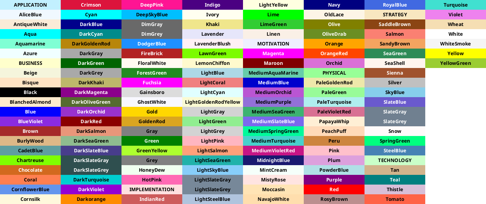
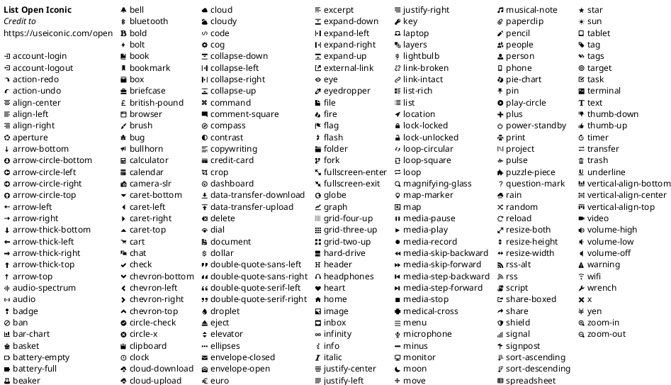
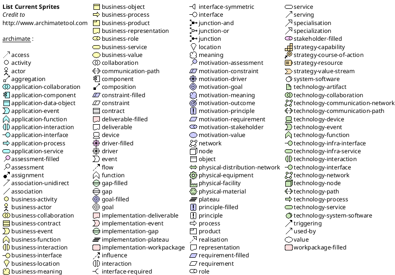

# PlantUML Reference

## Colors



## Icons



## Sprites



## Component diagram using external icons

```puml
@startuml

' scale 1000 width

skinparam style strictuml
skinparam backgroundColor transparent

!include libraries/gilbarbara/kafka.puml
!include libraries/gilbarbara/kotlin.puml
!include libraries/gilbarbara/aws-api-gateway.puml
!include libraries/gilbarbara/aws-cognito.puml

!$disabled = "<color:lightgray><size:14>"


rectangle "<size:20>Client" as Client #LightCyan
rectangle "<$aws-cognito>\nCognito" as AzureAD
rectangle "<$aws-api-gateway>\nAPI_GATEWAY" as APIG

rectangle GCP #LightCyan {
    node "<$kotlin>\nServiceA" as ServiceA
    node "<$kotlin>\nServiceB" as ServiceB
    node "<$kotlin>\nServiceC" as ServiceC
    queue "<$kafka>" as Queue
}

Client -right[#lightgray,thickness=3]-> AzureAD : $disabled Get Token
Client -right[thickness=3]-> AzureAD : Get Token
Client -right[#lightgray]-> APIG : $disabled Pass token
APIG -up[#lightgray]-> AzureAD : $disabled Validate token
APIG -right[#lightgray]-> ServiceA : $disabled Pass token
ServiceA -up[#lightgray]-> AzureAD : $disabled Validate token
ServiceA -right[#lightgray]-> ServiceB : $disabled Pass token
ServiceB -up[#lightgray]-> AzureAD : $disabled Validate token
ServiceA -down[#lightgray]-> Queue : $disabled Pass token
Queue -down[#lightgray]-> ServiceC : $disabled Pass token
ServiceC -up[#lightgray]-> AzureAD : $disabled Validate token

@enduml
```
